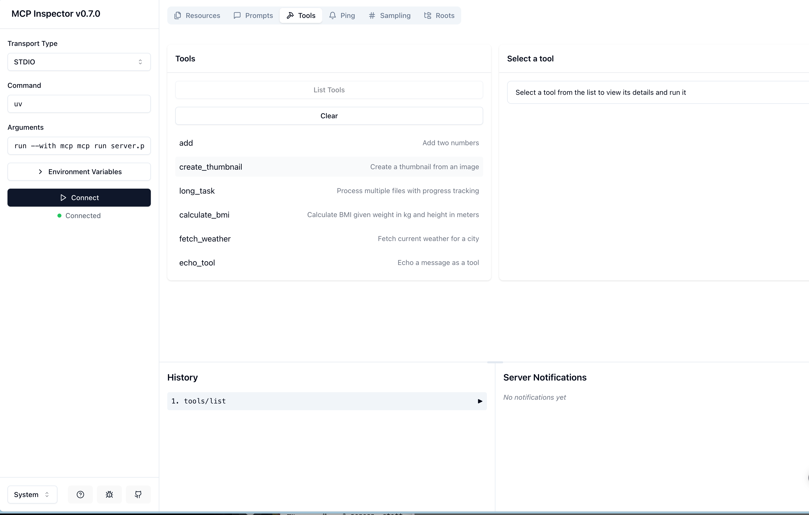

# mcp-server
MCP server for experimenting with LLM tools

## Dependencies

* Install 'uv'
* run `uv sync`

## Unit tests

* `uv run pytest`

## Launch the server

`uv run mcp dev server.py`
```
(.venv) ➜  mcp-server git:(main) ✗ uv run mcp dev server.py
Starting MCP inspector...
Proxy server listening on port 3000

🔍 MCP Inspector is up and running at http://localhost:5173 🚀
```

## View the tools


